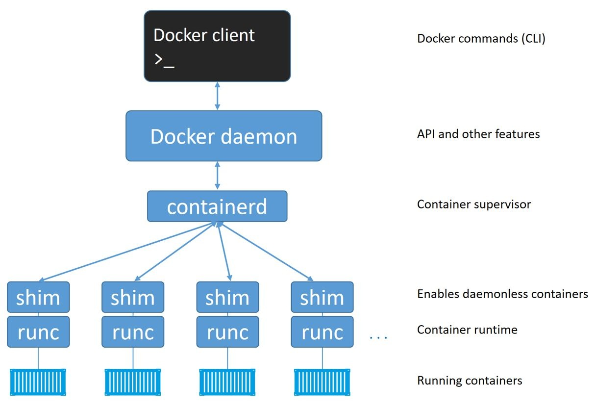
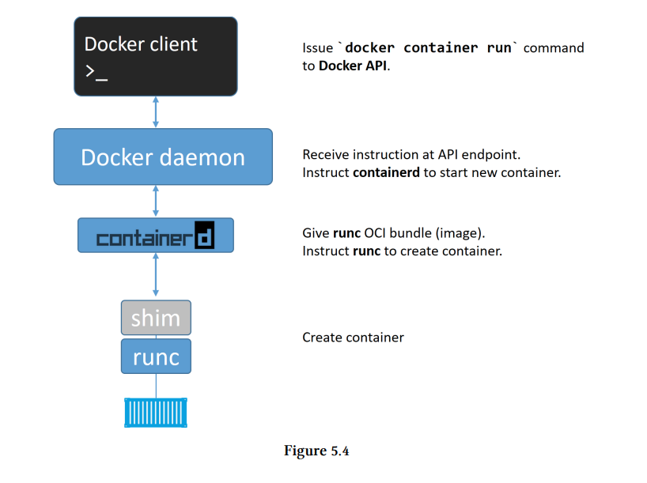
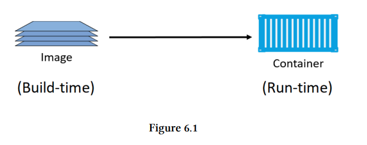

# Docker Deep Dive Notes


To understand docker we need to deep dive into the docker engine and its modularized components. Let us learn more about it

## Tools that Docker Engine is modularized into


<p align="center">
  
</p>


* **Docker Client** : Whatever commands we type into the docker client get converted into an API payload and given to the docker daemon

* **Docker daemon** : It is responsible for communication with containerd. 

* **containerd** : containerd acts as a container supervisor, it is basically responsible for the container lifecycle ie to start, stop or pause and unpause a container. **It is only interested in lifecycle operations**.

* **runc** : It is a CLI tool for spawning and running containers according to something called as the OCI specification. **It has a single purpose in life and that is to create containers**. containerd provides runc with a valid OCI bundle for runc to make a container of

## Process of container creation

a) The docker client receives the command `docker run -d hello-world:latest` and converts it into a API Payload and sends a POST call to the docker daemon

b) The docker daemon receives the command and tells `containerd` to create the container.

c) Now remember `containerd` cannot create a container. So it converts it into an appropriate OCI bundle and sends it to runc. 

d) `runc` then pulls in all the required kernel objects like namespaces and cgroups and spins up the container.

<p align="center">
  
</p>


# Docker images

Docker images are like `build-time constructs` whereas containers are like `runtime constructs`.

<p align="center">
  
</p>

An image usually contains only the necessary OS related components to run and relies on the host kernel to run. 
A newly installed docker host does not contain any local image repositories. The local image repository on a Linux-based Docker host is usually located at
`/var/lib/docker/<storage-driver>`. On Windows-based Docker hosts this is `C:\ProgramData\docker\windowsfilter`


# Docker Application 

The next section aims to focus on only the applications of docker and its various commands. 

# Docker networking

Every container has its own IP address. If you start a container and inspect it using the `docker inspect` command you should see something like this : 

```
"Networks": {
                "bridge": {
                    "IPAMConfig": null,
                    "Links": null,
                    "Aliases": null,
                    "NetworkID": "a7b8d2171e11af6fed0c95caebe28716dc5476bb9460a4dbb71b13e3c7e57c03",
                    "EndpointID": "",
                    "Gateway": "",
                    "IPAddress": "172.168.1.13",
                    "IPPrefixLen": 0,
                    "IPv6Gateway": "",
                    "GlobalIPv6Address": "",
                    "GlobalIPv6PrefixLen": 0,
                    "MacAddress": "",
                    "DriverOpts": null
                }
            }
```

In the above output the IPAddress key shows the address on which the container is being run on. If you execute a `curl` on this IPAddress it will output the result of the api call. 

Each docker container uses a network and by default this network is `bridge`.You can have a look at the available networks by using the following command.

* `docker network ls` : This command lists out the networks avaiable or technically lists all the networks the Engine `daemon` knows about. Example output can be seen here : 

```

NETWORK ID          NAME                DRIVER              SCOPE
a7b8d2171e11        bridge              bridge              local
4257f48825f8        host                host                local
000a4584959d        none                null                local

```
    
As you can see there are three networks here: host, bridge and none. The scope of each network is local.


## Publishing docker Ports

By default, when you create or run a container using docker create or docker run, it does not publish any of its ports to the outside world. To make a port available to services outside of Docker, or to Docker containers which are not connected to the container’s network, use the --publish or -p flag. This creates a firewall rule which maps a container port to a port on the Docker host to the outside world. Here is an example

* ` docker run -it -P image_name` : This command assigns the exposed port on the container to any random port on the host machine.

* `docker run -it -p 8080:80` : This command assigns the exposed port 8080 on the container to the port 80 on the host machine. 

* `docker run -it --network=host image_name` : This command exposes all of the services on `localhost`.

* `docker run -it --network=none image_name` : This command choses the `none` network ie no network is chosen.


# Storage in Docker

There are three types of methods to store/share information between the host and the container 

* Volumes

* Bindmounts

* tmpfs

Let us look at each of these options in depth and when would be the best case at using each one of them. 


### Bindmounts 

A bind mount is a file or folder stored anywhere on the container host filesystem, mounted into a running container.
**Alert** : Bindmounts are managed by the user and not docker.


### Volumes

* Decoupling container from storage
* Share volume among different containers
* Attach volume to containers
* On deleting container volume does not delete

You can check the volumes using `docker volume ls`


# Tags

In simple words, Docker tags convey useful information about a specific image version/variant. Tags are used to mark images with a particular value so that we can identify versions of images and use them accordingly. By default docker uses the `latest` tag. 

For example:

`docker build -t "demo ."`: This would tag the image demo as `latest`. (default behaviour)

`docker tag image_name tag`: This command tags the image with the tag.

`docker tage image:latest image:v3` : This command tags the image 


# Docker Compose


TO-DO

a) Complete the architecture deep dive

